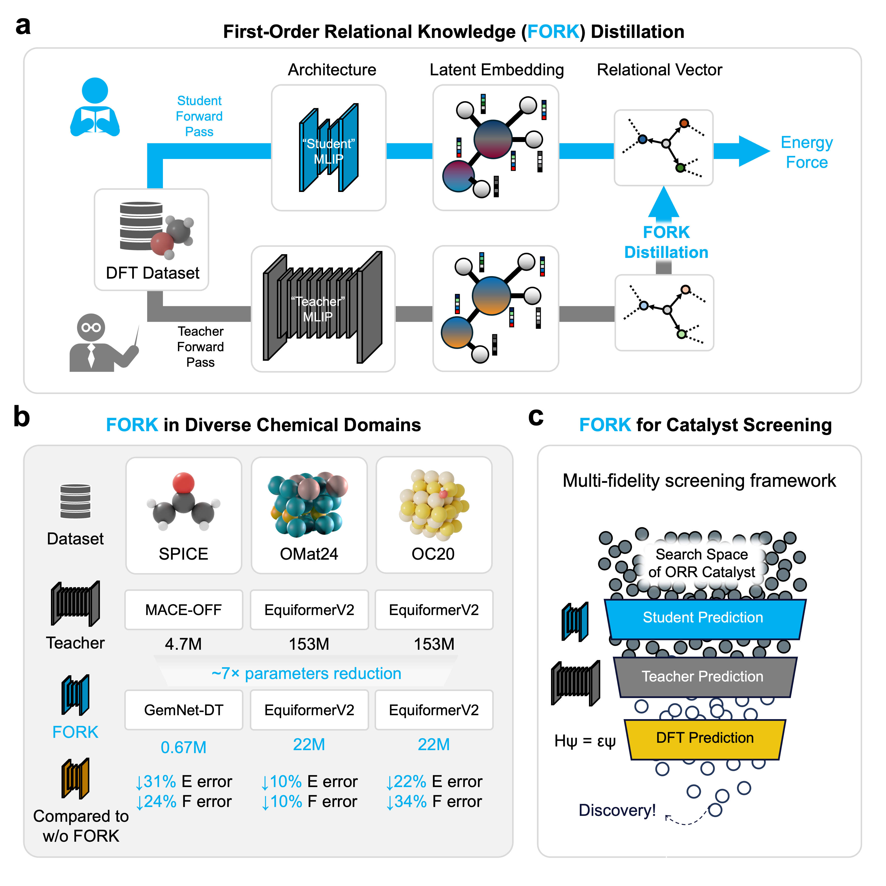

# ARK: Angular Relational Knowledge Distillation

This repository contains the implementation used in:

**Angular relational knowledge distillation of machine learning interatomic potentials for scalable catalyst exploration**  

ARK distills relational physics from a large teacher MLIP into a compact student by aligning **edge-level relational vectors** with a contrastive objective.

  

## Model configurations and benchmark results

### Model configurations

Compression ratio denotes the parameter reduction from teacher to student.

| Domain | Dataset | Teacher | Student | Compression |
| --- | --- | --- | --- | --- |
| Catalysis | OC20 | EquiformerV2 (153M) | EquiformerV2 (22M) | 7.0x |
| Materials | OMat24 | EquiformerV2 (153M) | EquiformerV2 (22M) | 7.0x |
| Molecules | SPICE | MACE-OFF Large (4.7M) | GemNet-dT (0.67M) | 7.0x |

### Distillation results

`ARK` uses n2n loss for OC20 and OMat24, and n2n + Hessian loss for SPICE.  
Hessian distillation was not applied to OMat24.  
Best student results are in **bold**.

| Training strategy | OC20 O* Energy | OC20 O* Force | OC20 200K Energy | OC20 200K Force | OMat24 Rattled-1000 Energy | OMat24 Rattled-1000 Force | OMat24 Rattled-1000 Stress | SPICE Monomers Energy | SPICE Monomers Force | SPICE Solvated AA Energy | SPICE Solvated AA Force | SPICE Iodine Energy | SPICE Iodine Force |
| --- | --- | --- | --- | --- | --- | --- | --- | --- | --- | --- | --- | --- | --- |
| Teacher | 39.8 | 5.8 | 171.5 | 12.4 | 9.7 | 56.3 | 3.4 | 0.65 | 6.6 | 1.3 | 19.4 | 1.3 | 15.3 |
| Undistilled | 294.5 | 5.9 | 474.9 | 51.8 | 18.1 | 92.5 | 4.1 | 2.2 | 13.4 | 1.7 | 22.9 | 3.2 | 25.4 |
| n2n | 252.9 | 5.8 | 412.8 | 34.8 | 17.5 | 88.6 | 4.1 | 2.3 | 14.5 | 1.5 | 21.4 | 3.0 | 25.9 |
| Hessian | OOM | OOM | OOM | OOM | OOM | OOM | OOM | **1.2** | **8.5** | **0.4** | **11.4** | 2.4 | 19.6 |
| ARK | **231.7** | **5.8** | **371.1** | **34.1** | **16.3** | **83.0** | **4.0** | 1.4 | 8.9 | **0.4** | 11.9 | **2.2** | **19.4** |

All entries are Mean Absolute Error (MAE) unless otherwise noted.  
OC20 energy units: meV.  
OMat24 and SPICE energy units: meV/atom.  
Force units: meV/A.  
Stress units: meV/A^3.

## Detailed Experiments

They are in each subfolder's README.md file.

## Acknowledgement

This repository builds on:

- EquiformerV2: https://github.com/atomicarchitects/equiformer_v2
- FAIRChem: https://github.com/facebookresearch/fairchem
- Hessian distillation: https://github.com/ASK-Berkeley/MLFF-distill